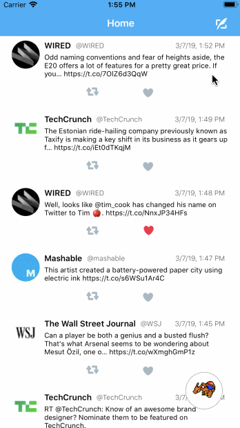
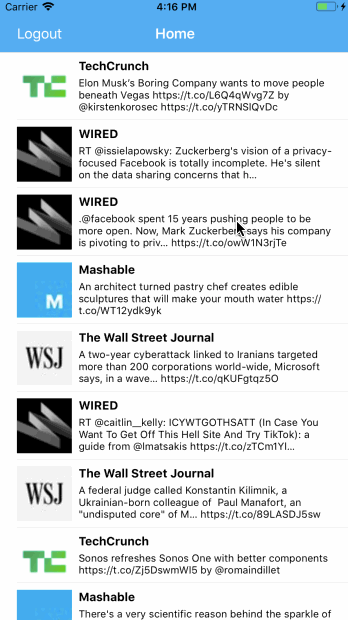

# Project 3 - *LeetTweets Twitter Clone*

**LeetTweets** is an iOS twitter client to read your tweets.

Time spent: **3** hours spent in total (Part 1)
Time spent: **7** hours spent in total (Part 2)

## Twitter - Part II

### User Stories

The following **required** functionality is completed:

- [x] User can compose a tweet. (4pts)
- [x] User can favorite a tweet. (4pts)
- [x] User can retweet a tweet. (2pts)

The following **bonus** features are implemented:

- [ ] When composing a tweet, user sees a countdown for the number of characters remaining for the tweet (out of 140) (2pts)
- [ ] User can view their profile in a profile tab. (3pts)
- [ ] User sees embedded images in tweet if available. (3pts)

Extra features I added:

- [x] Alert controllers for better user experience
- [x] Programmatically styled various UI components
- [x] Add user handle, timestamp Label to tweetCell to make it look more "complete".
- [x] SideMenu for better user navigation (had a hard time configuring this)

To-do/Work-in-progress:

- [ ] When a user clicks on a retweet button, add an alert controller asking for confirmation
- [ ] Add Favorite/Retweet numbers
- [ ] Add Followers/Following data
- [ ] Style Profile page
- [ ] Style Side Menu/Clean up UI

### App Walkthough GIF

Here's a walkthrough of implemented user stories in Part 2:

  

## Twitter - Part 1

### User Stories

The following **required** functionality is completed:

- [x] User sees app icon in home screen and styled launch screen. (1pt)
- [x] User can log in. (1pt)
- [x] User can log out. (1pt)
- [x] User stays logged in across restarts. (1pt)
- [x] User can view tweets with the user profile picture, username, and tweet text. (6pts)

The following **bonus** features are implemented:

- [x] User can pull to refresh. (1pt)
- [x] User can load past tweets infinitely. (2pts)

### App Walkthough GIF

Here's a walkthrough of implemented user stories:

  

### License

Copyright 2019 Matthew Rodriguez

Licensed under the Apache License, Version 2.0 (the "License");
you may not use this file except in compliance with the License.
You may obtain a copy of the License at

http://www.apache.org/licenses/LICENSE-2.0

Unless required by applicable law or agreed to in writing, software
distributed under the License is distributed on an "AS IS" BASIS,
WITHOUT WARRANTIES OR CONDITIONS OF ANY KIND, either express or implied.
See the License for the specific language governing permissions and
limitations under the License.
